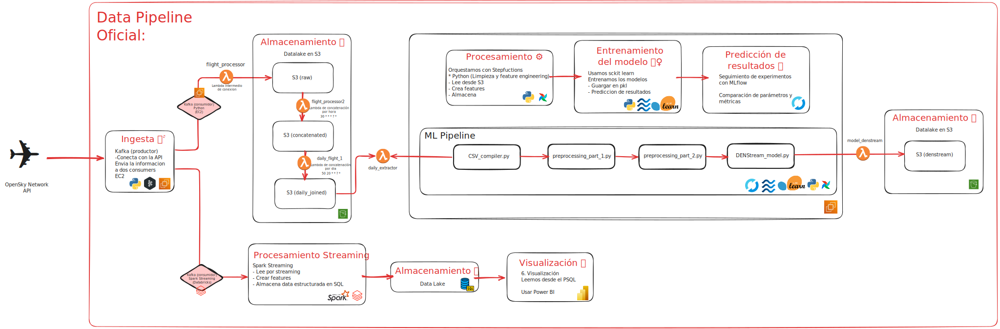
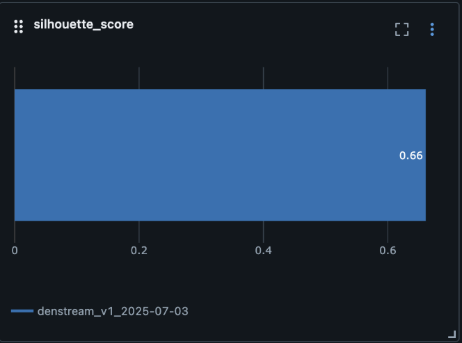
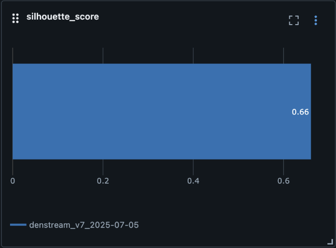
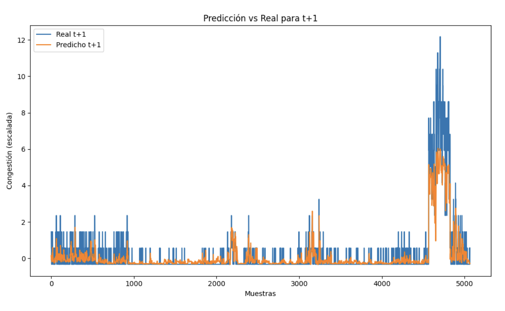
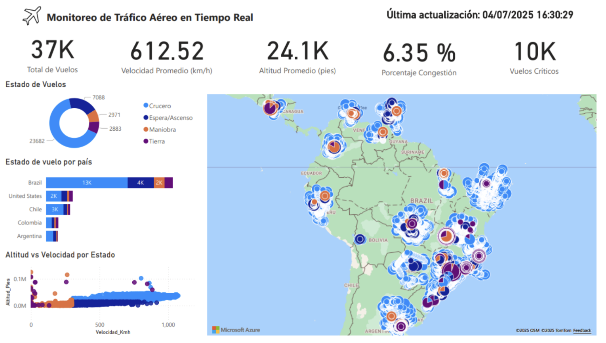
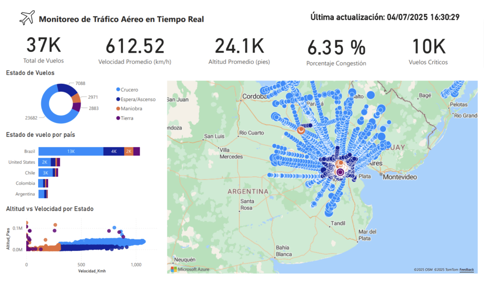

# Detección de tráfico aéreo en Sudamérica

### Intregrantes: 
* Antúnez Alfaro, Max Bryam
* Castro Vergara, Rodrigo Alonso
* Escalante Ccoyllo,  Nahía Alejandra
* Paico Reina, Aleksander Fabrizio
* Rojas Urquizo, Andrés Alejandro

## Introducción y justificación del problema a resolver
El aumento constante del tráfico aéreo mundial ha complicado la gestión del espacio aéreo, creando desafíos para la seguridad y eficiencia. Un problema clave es identificar a tiempo las zonas con alta congestión, donde muchas aeronaves coinciden o transitan simultáneamente. Este proyecto propone un sistema en tiempo real para detectar zonas de congestión aérea en Sudamérica, ayudando a controladores y aeropuertos a visualizar áreas con mayor densidad de vuelos. Mediante análisis de Big data y mapas, busca optimizar rutas y reducir riesgos. 

## Descripción del dataset, origen y tamaño de data
Para el desarrollo usamos la API de OpenSky Network (link), que nos proporciona datos gratuitos de aeronaves en tiempo real. A través de Kafka consumimos esa información cada minuto, solicitando la posición de todos los aviones sobre América del Sur. Como la transmisión es continua, recibimos repetidamente datos del mismo avión en distintos minutos y, por tanto, en diferentes posiciones.
Al final, el dataset contendrá las siguientes variables:
- icao24: la placa del avión
- callsign: Identificador para el control de tráfico aéreo
- origin_country: País del que el avión ha salido
- time_position: Posición horaria en la que se encuentra la aeronave
- last_contact: El último contacto que tuvo
- longitude: Coordenadas
- latitude: Coordenadas
- baro_altitude: Altitud en la que se encuentra el avión
- on_ground: Booleano que indica si el avión está en tierra
- velocity: Velocidad a la que va el avión
- heading: Ángulo de ataque del avión
- timestamp_ingest: Momento en el que la data fue consumida

## Dificultad técnica
Procesamiento y ML a tiempo real

## Herramientas y/o tecnologías empleadas
1. Kafka: Para la ingesta de la data en tiempo real
2. Airflow: Para la orquestación del ML Pipeline
3. Data Lake - S3: Usado para guardar toda la data que llega, incluso la que generamos nosotros
4. Data Lake - Databricks: Usado para guardar la data tras un procesamiento en tiempo real de la misma
5. Spark: Para hacer el procesamiento en tiempo real usando Spark Streaming
6. MLflow: Para la visualización de los experimentos de los algoritmos de ML
7. Power BI: Para la visualización de la data
8. Uso de AWS para la parte Cloud: La sección del uso de Kafka y la orquestación son realizados en máquinas virtuales EC2, además, el almacenamiento del Data Lake son usados en S3.

## Indicaciones de ejecución
El proyecto consta de 4 partes:
- Kafka
- Airflow
- Databricks
- Power BI

Cada una de estas secciones debe ser encendida manualmente.

### Kafka

Los scripts de Kafka se encuentran en un EC2. Para acceder:

```bash
ssh -i <ubicacion_del_pem>/labsuser.pem ec2-user@52.205.209.139
```

Dentro, debes ejecutar los containers principales:

```bash
docker start kafka zookeeper
```

Luego, accede a la carpeta `kafka/` y activa el entorno virtual:

```bash
source venv/bin/activate
```

Para crear el topic (opcional si ya existe):

```bash
python flight_topic.py
```

Para ejecutar el **consumer** (recomendado iniciar primero):

```bash
python flight_consumer.py
```

Para ejecutar el **producer**:

```bash
python flight_producer.py
```

> 💡 Se recomienda usar `tmux` o abrir otra terminal para correr ambos procesos al mismo tiempo.  
> El consumer se usa para almacenar la data en el Data Lake.

---

### Airflow

Accede al EC2:

```bash
ssh -i <ubicacion_del_pem>/labsuser.pem ubuntu@44.209.38.71
```

Activa el entorno virtual:

```bash
source airflow-py/venv/bin/activate
```

Ejecuta Airflow:

```bash
airflow scheduler
airflow webserver
```

Ejecuta la UI de MLflow:

```bash
mlflow ui --backend-store-uri /home/ubuntu/mlruns --host 0.0.0.0 --port 8082
```

- **UI Airflow**: [http://44.209.38.71:8080](http://44.209.38.71:8080)
- **UI MLflow**: [http://44.209.38.71:8082](http://44.209.38.71:8082)

Para iniciar el flujo de trabajo, ir al DAG `MLPipeline` y activarlo manualmente. Esto recolectará la data del día anterior desde S3, la procesará y generará resultados y métricas en MLflow.

---

### Databricks

Para usar la sección del Data Lake, el producer de Kafka debe estar encendido, ya que se reciben datos en tiempo real desde la API.

El procesamiento en Databricks está optimizado para serverless. En lugar de un stream continuo, se usan micro-lotes procesados mediante triggers cada 15 minutos.  
Todo el flujo se automatiza con un **Databricks Job** programado para cada 15 minutos, asegurando la actualización constante.

---

### Power BI

La visualización se realiza en Power BI conectándose por **DirectQuery** a la tabla Delta Lake en Databricks.  
Esto asegura dashboards siempre actualizados con los micro-lotes nuevos.  
Las transformaciones se hacen en Databricks y en Power BI solo se enfocan en visualización y medidas DAX cuando es necesario.


## Arquitectura del proyecto

Enlace: [Imagen completa](https://excalidraw.com/#room=8aa0eac536892d50bc29,IdKkZRdkRXOSZVbFQ2dmNw)

### Ingesta de Datos (Kafka)

- **Origen**: Datos de vuelos capturados desde la API de OpenSky Network.
- **Productor Kafka**: Conecta con la API cada minuto y transmite los datos de ubicación aérea.
- **Consumidor EC2**: Una instancia EC2 recibe los mensajes y envía los datos al data lake en S3.
- **Consumer Databricks**: Vía Spark Streaming, se reciben y procesan los datos en tiempo real antes de ser almacenados de forma estructurada.

---

### Almacenamiento en S3 (Data Lake)

Se organiza en diferentes capas:

- **S3 (raw)**: Datos en crudo directamente desde Kafka.
- **S3 (concatenated)**: Datos concatenados por hora mediante la función `flight_processor2` en Lambda.
- **S3 (daily-joined)**: Resultado final del día, generado por `daily_flight_1` (Lambda). Básicamente es una concatenación de todos los datos por hora.

---

### Procesamiento (Airflow)

- Se orquesta con scripts Python para limpieza y generación de features usando Airflow.
- Se extraen datos diarios (`daily_extractor`), que obtiene los datos del día anterior al momento de iniciar la orquestación y los compila en CSV (`CSV_compiler.py`).
- Para la primera parte se aplican dos etapas de preprocesamiento:
  - `preprocessing_part_1.py`
  - `preprocessing_part_2.py`

---

### Entrenamiento de Modelos (Airflow)

- Se entrena el modelo de Machine Learning con Scikit-learn dentro de la misma orquestación de Airflow:
  - `DENStream_model.py` para clustering.
- Los modelos se almacenan en S3:
  - **S3 (denstream)**
- Para visualizar los resultados se usa MLflow.

---

### Procesamiento en Streaming (Spark Streaming)

- Usamos Spark Streaming para leer datos nuevos directamente del tópico de Kafka con `spark.readStream`.
- Procesa los datos y crea features en tiempo real, como `estado_de_vuelo` o `Indicador_Congestion`.
- Opera en micro-lotes (trigger) y guarda los resultados en una tabla Delta Lake gobernada por Unity Catalog.

---

### Visualización (Power BI)

- Se conecta a Databricks con **DirectQuery**, asegurando que los datos se muestren en tiempo real.
- Recibe datos ya limpios y transformados, enfocándose únicamente en la capa de visualización y en el cálculo de funciones DAX.

## Describir cómo los datos serán extraídos, transformados y cargados (ETL/ELT)

Utilizamos Kafka para conectarnos con la API de Open Sky Network, la cual envía la información a dos consumidores en la instancia EC2. El primer consumidor se encarga del proceso ELT para alimentar el modelo de machine learning, mientras que el segundo realiza el proceso ETL para generar las visualizaciones.

El primer flujo comienza con Kafka funcionando como productor, el cual se conecta a la API de Open Sky Network para obtener datos en tiempo real. Esta información se envía a dos consumidores en una instancia EC2 escritos en Python. A través de un Lambda intermedio llamado flight_processor, los datos se almacenan primero en el datalake de S3 en la carpeta raw. Luego, la función Lambda flight_processor2 se encarga de concatenar los archivos por hora (cada 30 minutos) y guarda el resultado en un bucket de S3 llamado concatenated. Finalmente, la función Lambda daily_flight_1 concatena toda la información acumulada durante el día (programada a las 20:50) y almacena el resultado final en una carpeta del S3 llamada daily_joined. Una vez que los datos diarios están consolidados en el bucket daily_joined de S3, se activa la función Lambda daily_extractor, la cual extrae estos datos procesados y los envía al script csv_compiler.py. Este script se encarga de compilar y transformar los datos en archivos csv listos para su análisis. Después, se inicia la etapa de procesamiento. Esta fase se orquesta con Airflow y scripts en Python, donde se realiza la limpieza de datos y la creación de nuevas features. Para ello, se ejecutan los scripts preprocessing_part_1.py y preprocessing_part_2.py, preparando los datos para el modelado. Seguidamente, se entrena un modelo basado en el algoritmo DENStream mediante DENStream_model.py, y durante el entrenamiento se usa scikit-learn, river y MLflow para gestionar experimentos, guardar los modelos en formato .pkl y realizar la predicción de resultados, permitiendo comparar métricas y parámetros de forma estructurada. Una vez finalizado el entrenamiento, entra en acción la función Lambda model_denstream, la cual se encarga de tomar el modelo entrenado y gestionar su envío al datalake en S3. Esta Lambda actúa como un puente automatizado que facilita el almacenamiento seguro y organizado en la carpeta denstream del bucket, asegurando que el modelo final quede disponible y versionado para futuras consultas, evaluaciones o integraciones. Con este paso, el flujo cierra el ciclo de procesamiento y entrenamiento, dejando el modelo listo y almacenado en la nube.

El segundo flujo comienza con la API de OpenSky Network, desde donde se obtiene información en tiempo real sobre el tráfico aéreo. Kafka actúa como productor, conectándose a esta API para recibir y distribuir los datos.
Esta información se envía a un consumidor configurado con Spark Streaming en Databricks. Durante esta etapa de procesamiento en streaming, Spark lee los datos a medida que llegan y aplica una serie de transformaciones:
Parseo y Estructuración: Los mensajes binarios crudos de Kafka son parseados usando un esquema predefinido, convirtiendo los datos JSON en un DataFrame estructurado.
Enriquecimiento y Creación de Features:
Los timestamps de posición e ingesta se convierten a formatos de fecha/hora legibles.
La altitud se convierte de metros a pies y la velocidad de m/s a km/h.
Se crean columnas categóricas como estado_de_vuelo, Indicador_Congestion y Cuadrante (cuadrante geográfico).
Se extraen componentes de fecha y hora (día, mes, hora) para un análisis granular.
Carga en Delta Lake: Los datos procesados se cargan en una tabla Delta llamada flights_gold utilizando el método .toTable(), que es compatible con Unity Catalog. Para gestionar los datos y los checkpoints de forma segura, se utilizan los Volúmenes de Unity Catalog, evitando problemas de ruteo directo en DBFS.
Finalmente, para la etapa de visualización, Power BI se conecta directamente a la tabla flights_gold en el Data Lake de Databricks. Esta conexión directa permite la creación del dashboard que refleja el estado casi en tiempo real del tráfico aéreo, facilitando un monitoreo continuo.
Las principales visualizaciones creadas incluyen:

Tarjetas de KPI: Muestran métricas en tiempo real como Vuelos Totales, Velocidad Promedio (km/h), Altitud Promedio (pies), Porcentaje de Congestión y Vuelos Críticos.
Gráfico de Dona: Representa la distribución de vuelos según su estado actual (Crucero, Espera/Ascenso, Maniobra, Tierra).
Gráfico de Barras Apiladas: Compara la distribución de los estados de vuelo entre diferentes países de origen (Brasil, EE.UU., Chile, Colombia, Argentina).
Diagrama de Dispersión: Correlaciona la velocidad de vuelo con la altitud, donde los puntos están coloreados por estado de vuelo para identificar patrones operativos y anomalías.
Mapa Geoespacial Interactivo: Ubica cada vuelo en su localización en tiempo real. El color de cada punto indica el estado del vuelo y su tamaño puede representar el nivel de congestión o criticidad, permitiendo una fácil identificación de las zonas de alto tráfico.


## Resultados obtenidos y análisis
Los datos procesados y almacenados en el Data Lake permitieron visualizar zonas con alta concentración de vuelos mediante dashboards interactivos en Power BI, facilitando la identificación de posibles zonas de congestión aérea.

Gracias al preprocesamiento y la generación de features, el modelo entrenado(DENStream) mostró una alta capacidad para detectar patrones y predecir posibles acumulaciones futuras de tráfico aéreo. Las métricas obtenidas y registradas en MLflow permitieron comparar distintas configuraciones y ajustar los parámetros de los modelos para mejorar la precisión.

Vimos que al usar el algoritmo de DENStream sobre la data en diferentes días (tener en cuenta que la data que obtenemos es del dia del anterior al que estamos haciendo la prueba del modelo), el silhouette score, sale muy similar, lo cual nos da a entender que la estructura espacial de los datos (agrupamiento de los aviones por posición), no cambia drásticamente, y eso es una señal de consistencia de los patrones de tráfico aéreo diario para la región y escala temporal que estamos evaluando. 




Según esto, podemos ver que el tráfico aéreo en la región es regular, predecible y tiene baja variabilidad diaria, lo cual es una información útil a la hora de hacer la planificación operativa.

Además de la detección de clústeres de congestión con DENStream, se logró implementar un modelo de series de tiempo basado en LSTM, diseñado para predecir la congestión aérea futura, basado en datos históricos. Aunque su integración en el pipeline de AWS aún no se ha completado, el modelo fue desarrollado y probado exitosamente en un entorno local, demostrando su potencial para anticipar la congestión aérea.

El proceso se llevó a cabo de la siguiente manera:

1. Preparación y Ventaneo de Datos: Se implementó un preprocesamiento para transformar los datos agregados en "ventanas" de tiempo, estructurando la información en secuencias con un lookback (pasos hacia atrás) para predecir un horizon (pasos futuros).

2. Entrenamiento y Optimización: Utilizando PyTorch, se construyó y entrenó un modelo LSTM. Se realizó una búsqueda sistemática de hiperparámetros y se utilizó MLflow para registrar los experimentos y seleccionar la configuración más óptima.

3. Evaluación y Simulación: El mejor modelo fue evaluado contra datos de validación. 




El modelo LSTM funciona excelentemente para predicciones tácticas a corto plazo (ej. próximos minutos) y es muy útil para alertas estratégicas a largo plazo. Si bien no puede predecir el valor exacto de la congestión con 30 minutos de antelación, sí puede advertir de manera fiable si se espera que el tráfico aumente o disminuya significativamente, cumpliendo con el objetivo central del proyecto.


## Dificultades identificadas al momento de implementar la solución
- Conectar el producer de kafka a un consumer en Databricks: A la hora de querer hacer la conexión con Databricks desde AWS, en un inicio la información que encontramos, nos decía que no se podría usar la cuenta de community edition para Spark Streaming, por restricciones, por lo que optamos por usar una cuenta de free edition. El problema es que esta cuenta tenía limitaciones con respecto a los clusters y trabajo con data por streaming. Decidimos pasar a una cuenta de free try, pero esta tenía el mismo problema. Al final vimos que con la cuenta de community edition podíamos hacer la recepción de los datos por streaming, pero con la limitación que teníamos que cambiar de cluster cada vez que uno se cerraba.
- Hacer conexiones con el S3 para almacenar la información y sobre todo para extraerla: En un inicio esperábamos hacer conecciones directas desde el EC2 al S3 pero por restricciones del rol que tenemos (rol de estudiante), no era posible, por lo que hicimos conecciones a través de lambdas. Esto nos permite también personalizar la hora de ejecución de cada lambda. Además, el problema más grande que tuvimos aquí fue a la hora de extraer información del S3, ya que necesitábamos permisos especiales, que al final logramos obtener. Principalmente, estas son las razones por la que la única vez que extraemos información del S3 es al inicio del ML Pipeline, además, evitamos hacer accesos al S3 de forma que omitamos crear más lambdas y tener más dificultades al respecto. Internamente en el EC2, creamos carpetas de archivos temporales para almacenar la información de un script a otro en el orquestador de AirFlow.
- Caídas en los servicios de AWS: En varias ocasiones, los servidores de AWS sufrieron varias caídas. Esto no es la primera vez que pasa, los servidores de estudiante de AWS son muy propensos a que se caigan. Esto hace que no podamos hacer actualizaciones en el sistema y no podamos trabajar directamente en el pipeline por varias horas.
- Uso del Airflow (desde el EC2 ubuntu y desde MacOS): Desde un inicio, tuvimos problemas para instalar y ejecutar Airflow en MacOS, lo cual nos  limitaba a la hora de hacer pruebas. Intentamos instalaciones desde Docker, usando docker-file custom y oficiales, pero en ninguno de los casos nos sirvió. Siempre teníamos un problema con el worker, el scheduler o incluso con el webserver. A la hora de usar Airflow en EC2, tuvimos los mismos problemas, incluso tuvimos problemas a la hora de hacer ejecuciones, ya que AirFlow podía llegar a ser muy pesado, por lo que tuvimos que usar máquinas virtuales más grandes y con más almacenamiento. Aun así, Airflow desde Docker no nos funcionó en ningún momento, por lo que optamos por ir con una versión directamente desde Python, siguiendo las instrucciones de este repositorio de GitHub 
Enlace: [Repositorio](https://github.com/hitchon1/setup-airflow-ec2), logramos solucionar los problemas que tuvimos. Para el caso de MacOS, lamentablemente aún no logramos solucionar el problema, las pruebas que hicimos posteriormente fueron directamente en el EC2.
- Limitaciones del Streaming en Databricks Serverless: El enfoque inicial de un pipeline de streaming continuo no fue viable. Los clústeres Serverless de Databricks no soportan flujos infinitos por defecto, lo que obligó a rediseñar la arquitectura hacia un modelo de micro-lotes activado por disparadores (trigger).
- Conflictos de Permisos con Unity Catalog: Durante la fase de escritura, aparecieron errores de permisos como “Public DBFS root is disabled”. Esto se debió a Unity Catalog, que bloquea el acceso directo a las rutas de DBFS. La solución fue adoptar el uso de “Volumes” de Unity Catalog para gestionar los datos y los checkpoints.
- Integración del Modelo LSTM en el Pipeline de AWS: A pesar de haber desarrollado y validado exitosamente el modelo LSTM basado en PyTorch en un entorno de desarrollo, surgieron dificultades significativas al intentar integrarlo en el pipeline automatizado en AWS y no se logró la adaptación del modelo para que fuera compatible con el flujo de datos orquestado. Debido a estas complejidades, se decidió posponer su despliegue final.





- La última hora de monitorización cubrió 37 000 vuelos en toda Sudamérica, lo que confirma que el sistema captura eficazmente el tráfico regional. La velocidad promedio registrada fue de 612,5 km/h, concentrada mayoritariamente entre 550 y 700 km/h, lo que coincide con los regímenes de crucero habituales. La altitud media fue de 24 100 pies, también dentro del rango de crucero comercial (FL240–FL360). Solo el 6,35 % de los vuelos se agrupan en zonas de alta densidad (más de cinco aeronaves en un área de 10×10 millas náuticas), lo que indica que la saturación global es baja y las alertas serán selectivas. Detectamos además 10 000 vuelos críticos, definidos como aquellos con maniobras atípicas o altitudes fuera del rango esperado; estas rutas deben revisarse para garantizar la seguridad.
- La distribución por estado muestra que 7 088 vuelos (≈19 %) estaban en crucero, seguidos de 2 971 en espera o ascenso y 2 883 en maniobra, mientras menos de mil estaban en tierra, confirmando el foco en el tráfico activo. Brasil aporta 13 000 vuelos, EE. UU. 2 000, Chile 3 000 y Colombia y Argentina cifras menores, lo que revela una comunicación intra-regional muy intensa, especialmente con Brasil. El diagrama de dispersión Altitud vs Velocidad presenta un cúmulo estable en torno a los rangos de crucero, y un pequeño porcentaje (< 5 %) de puntos fuera de esos límites corresponde a fases de ascenso o descenso.

## Conclusiones
Conclusiones del ML Pipelines:
- Podemos concluir según el lapso de tiempo que usamos para desarrollar el proyecto y visualizar los modelos, no tubimos una variación en el tráfico aéreo en general. Además, podemos notar por la formación de los clusters que los aviones durante estos días, han seguido rutas muy similares entre sí.
- También cabe destacar que, en la región en la que hicimos el experimento, generalmente no tiene un tráfico aéreo fluctuante como en otras regiones como América del Norte o Asia.


Conclusiones de Análisis Visualizaciones
- El sistema valida en vivo más de 37 000 vuelos y demuestra una cobertura casi total del espacio aéreo sudamericano y una capacidad consistente para distinguir fases de crucero, ascenso y maniobra terminal.
- Con un índice medio de congestión del 6,35 %, las zonas críticas quedan muy delimitadas (menos del 10 % del área total), lo que minimiza el “ruido” de alertas y garantiza que las intervenciones se centren sólo donde realmente hay acumulación de tráfico.
- La detección de 10 000 vuelos con maniobras atípicas o altitudes fuera de umbral permite asignar recursos de revisión prioritaria, por ejemplo replanificar aproximaciones en aeropuertos de alta actividad o gestionar separaciones en tiempo real.
- La intensa participación de Brasil (13 000 vuelos) subraya la necesidad de colaboración regional para equilibrar flujos y mitigar cuellos de botella.
- Aplicar técnicas de estimación de densidad de kernel sobre los puntos de congestión para generar “hotspots” temporales, y a partir de ellos ajustar dinámicamente la sectorización y los topes de flujo en horas punta.


Conclusiones Técnicas:
- Se usó Databricks con un cluster Serverless mediante una arquitectura de micro-lotes con triggers, demostrando ser una solución eficiente y compatible. La integración con Unity Catalog para gestionar los volúmenes de datos y la carga simplificada con el método .toTable() permitieron el almacenamiento en una tabla Delta Lake. La automatización de todo el proceso con un Databricks Job que se ejecuta cada 15 minutos garantiza la actualización constante de los datos para su análisis.
- Se logró crear un dashboard interactivo que visualiza eficazmente las zonas de alta concentración de vuelos conectándose directamente al Data Lake en Databricks. La conexión en DirectQuery a la tabla Delta Lake asegura que las visualizaciones se actualicen en tiempo real a medida que llegan nuevos datos. El diseño del dashboard incluye indicadores clave (KPIs), un mapa geoespacial y gráficos de distribución.
- Se hizo deploy del pipeline completamente en cloud, de forma que pueda correr sin la necesidad de depender de nuestro propio hardware o las configuraciones que tenemos en nuestras computadoras. 
- Se demostró la factibilidad y el alto potencial de utilizar modelos predictivos como las redes LSTM para anticipar la congestión aérea. Aunque su implementación se completó exitosamente en un entorno de desarrollo, su integración en el pipeline de nube automatizado quedó como un trabajo futuro, evidenciando la brecha que a menudo existe entre el modelado y el despliegue operativo 


## Posibles mejoras
- Una mejora fundamental sería migrar a una versión de pago de Databricks. Esto permitiría tener un clúster siempre activo, eliminando la necesidad de intervenciones manuales.
- Se podría mejorar el dashboard de PowerBI  implementando un sistema de alertas proactivas. Utilizando las capacidades de Power BI, se podrían configurar notificaciones automáticas que se disparen cuando los indicadores, como el Indicador_Congestion o el número de Vuelos Críticos, superen ciertos umbrales.
- Migrar a un AWS de pago, para poder mantener corriendo los sistemas sin tener que apagarlos.
- Agregar el modelo de LSTM al ML Pipeline. En un inicio se tenía planeado tener el lstm en funcionamiento, pero tras los problemas que tuvimos con AirFlow, retrasó la implementación de Modelos de ML adicionales que teníamos planeado, por lo que decidimos no ponerlo de momento.
- Integración de una UI para facilitar el acceso a los modelos usados, asi como agregar nuevos enlaces a los hiperparametros para que los usuarios los puedan modificar de forma rápida.
- Mayor seguridad a la hora de hacer acceso al S3 y a los EC2 principalmente.
- Integrar el modelo LSTM en el pipeline de producción de AWS: Dado que el modelo LSTM ya fue desarrollado y validado, el siguiente paso crítico es completar su despliegue en la nube. Esto permitiría que el sistema no solo visualice la congestión actual, sino que también ofrezca pronósticos automatizados.

